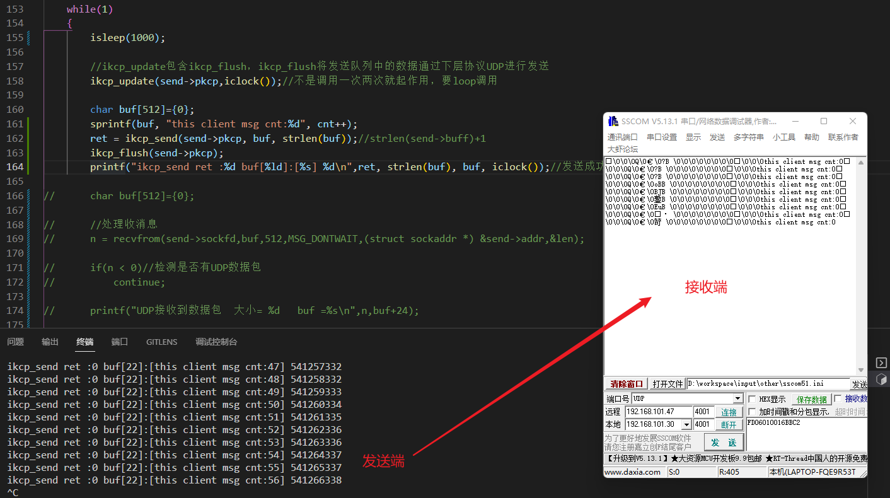

KCP：https://github.com/skywind3000/kcp.git

（感谢）工程基于：https://github.com/bamboo-blue/KCP_Learn.git

------

# // 工程使用

使用cmake管理编译

mkdir build

cd build

cmake ../

make

# //  测试

客户端：每个50ms,通过KCP发送4096字节数据到服务端。

服务端：接收到数据后校验

# //  注意

KCP有响应和重传机制

1. 在发送端，发送完数据后，会收到对端发来的ACK。所以发送端，除了提供发送接口外，依然需要提供接收数据的接口和相关的处理。
2. 在接收端，在接收到数据后，会向对端发送ACK。所以接收端，除了提供接收接口外，还需要提供发送接口。

所以需要客户端和服务器端配合使用

# //  踩坑

发送端每个1秒发送一帧数据，使用调试组手查看，发现接收到的一直是第一帧数据。
原因：接收端没有发送ACK给发送端，导致发送端一直重传

